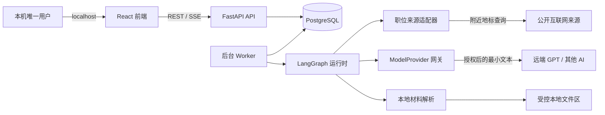

# 技术架构

## 1. 架构原则

- 本地优先：业务数据、精确地址、Graph 状态和审计记录保存在本机；
- 单用户：Demo 不实现注册、租户、角色和远端账号体系；
- Graph 隔离：三个业务闭环有独立状态、输入和写权限；
- 确定性优先：抓取、距离、去重、权限和持久化由普通代码完成，LLM 只处理语义任务；
- 最小外发：远端模型只接收当前任务必需、已授权且通过策略检查的文本；
- 可恢复：每次 Agent 运行有状态、checkpoint、幂等键和明确失败原因；
- 可替换：职位来源和模型 Provider 均通过接口接入。

## 2. 本地容器拓扑



Docker Compose 服务：

- `frontend`：React、TypeScript、Vite、Tailwind/shadcn；
- `api`：FastAPI、业务 API、策略校验、文件接收、Graph 手动触发；
- `worker`：使用与 API 相同的后端镜像，运行 APScheduler 并调用 LangGraph；
- `db`：PostgreSQL，保存业务表、Agent 运行和 checkpoint；
- `ollama`：不作为 Demo 必需容器；现有本机 Ollama 可用于开发回退或测试 Provider。

前端和 API 端口只映射到 `127.0.0.1`。数据库不映射到公网；开发时如需宿主机连接，也只绑定回环地址。

## 3. LangGraph 设计

### 3.1 `JobDiscoveryGraph`

状态输入：`run_id`、`source_id`、`landmark_id`、查询参数、触发方式。

节点顺序：

1. `load_source_policy`：读取允许的来源、速率和查询范围；
2. `select_landmark`：轮换选择附近地标，不读取精确住址文本；
3. `fetch_jobs`：调用 `JobSourceAdapter`；
4. `normalize_jobs`：映射统一职位 schema；
5. `deduplicate_jobs`：按来源 ID、规范链接和组合指纹幂等处理；
6. `resolve_job_location`：只对公开职位地点进行坐标解析；
7. `calculate_distance_local`：读取受限的本地精确坐标并计算 Haversine 距离；
8. `persist_jobs`：事务写入职位与运行统计；
9. `finalize_run`：记录成功、部分成功或失败。

约束：Graph 无权读取个人档案、简历、工作记录或模型密钥。抓取错误允许部分成功；解析失败的职位仍可保存，但距离状态必须明确。

### 3.2 `ProfileIngestionGraph`

状态输入：`import_id`、材料类型、用户选择的 Provider 策略。

节点顺序：

1. `validate_artifact`：校验大小、MIME、哈希和路径；
2. `convert_local`：使用 MarkItDown 或专用解析器生成本地文本；
3. `classify_and_minimize`：识别数据类别，只保留当前抽取所需片段；
4. `apply_outbound_policy`：删除禁止字段，检查本次授权；
5. `extract_structured_facts`：调用 `ModelProvider` 返回 schema 约束结果；
6. `validate_facts`：校验字段、日期、枚举和证据引用；
7. `reconcile_facts`：新增、更新、冲突或待确认，不静默覆盖；
8. `update_resume_draft`：从结构化事实生成新草稿版本；
9. `finalize_import`：保存统计、模型审计和失败原因。

约束：模型结果不能直接写入事实表；任何事实必须经过验证并携带 provenance。职位数据不作为输入。

### 3.3 `WorkReportGraph`

状态输入：`report_id`、报告类型、日期范围、Provider 策略。

节点顺序：

1. `load_work_entries`：读取指定日期范围；
2. `build_report_context`：排序、去重并生成最小上下文；
3. `apply_outbound_policy`：检查数据类别和授权；
4. `generate_report`：调用 Provider 生成结构化日报或周报；
5. `validate_report`：确保事实能回溯到输入记录，不生成不存在的成果；
6. `persist_report`：保存版本和来源范围；
7. `finalize_report`：记录运行状态。

约束：报告不会自动生成个人档案事实。未来“提升为档案事实”必须走独立 Approval。

## 4. 核心接口

### 4.1 后端领域接口

```python
class JobSourceAdapter(Protocol):
    async def search(self, query: JobSearchQuery) -> list[RawJob]: ...

class ModelProvider(Protocol):
    async def generate_structured(
        self,
        task: ModelTask,
        payload: SanitizedPayload,
        output_schema: type[BaseModel],
    ) -> BaseModel: ...

class ArtifactConverter(Protocol):
    async def convert_local(self, artifact: LocalArtifact) -> ConvertedText: ...
```

实现要求：

- `JobSourceAdapter` 的入参只能包含附近地标和公开查询条件；
- `ModelProvider` 只能接收 `SanitizedPayload`，不能接受任意字符串或文件路径；
- `ArtifactConverter` 只能读取系统为本次导入分配的受控路径；
- 每个接口调用必须绑定 `run_id`，用于审计和重试。

### 4.2 REST API 分组

- `/api/v1/location`：保存本地精确地址/坐标，读取时默认只返回掩码和配置状态；
- `/api/v1/landmarks`：管理用于外部查询的附近地标；
- `/api/v1/job-sources`：配置允许的职位来源和速率；
- `/api/v1/jobs`：职位列表、详情、距离和状态；
- `/api/v1/job-runs`：手动触发与查看采集运行；
- `/api/v1/imports`：上传材料、查看解析与抽取状态；
- `/api/v1/profile-facts`：查看、确认、驳回和修正结构化事实；
- `/api/v1/resume-drafts`：查看版本和导出结构化草稿；
- `/api/v1/work-entries`：每日工作记录；
- `/api/v1/reports`：生成和查看日报、周报；
- `/api/v1/agent-runs`：统一运行状态、错误和重试；
- `/api/v1/model-providers`：只返回配置状态和能力，不返回密钥；
- `/api/v1/approvals`：查看和处理需要确认的外部操作。

长任务由 API 返回 `202 Accepted + run_id`，前端通过轮询或 SSE 查看状态。Demo 优先采用轮询；SSE 仅在不增加实现风险时启用。

## 5. 数据模型

### 5.1 隐私与配置

- `user_settings`：单用户全局配置；
- `private_location`：精确地址、纬度、经度、更新时间；API 默认不回显原值；
- `external_landmarks`：地标名称、公开查询文本、可选公开坐标、启用状态、轮换序号；
- `model_provider_configs`：Provider 名称、模型名、能力、授权策略和密钥存在状态；密钥本体不入库。

### 5.2 职位

- `job_sources`：适配器、来源规则、速率、最近状态；
- `job_runs`：触发方式、地标、开始/结束时间、状态、计数和错误码；
- `job_postings`：规范字段、来源 ID、链接、工作地点、坐标、直线距离、距离状态、内容指纹；
- `job_observations`：同一职位每次被观察到的时间和关键字段快照。

唯一性优先级：`source + external_id`，其次 `canonical_url`，最后使用公司、标题、地点和发布时间的组合指纹。指纹去重只能合并高可信重复项，不确定时保留并标记。

### 5.3 档案与简历

- `import_artifacts`：材料元数据、受控路径、哈希、解析状态；
- `artifact_fragments`：本地解析片段与页码/位置；
- `profile_facts`：事实类型、结构化值、确认状态、时间；
- `fact_evidence`：事实与材料片段的关联；
- `fact_conflicts`：新旧事实冲突和处理结果；
- `resume_drafts`：版本化 JSON 草稿、来源事实集合、生成时间。

### 5.4 每日工作与运行

- `work_entries`：日期、正文、标签、更新时间；
- `reports`：日报/周报、日期范围、结构化内容、版本；
- `agent_runs`：Graph、checkpoint/thread ID、状态、阶段和错误；
- `model_call_audits`：Provider、模型、任务、数据类别、请求/响应哈希、token/耗时（可得时）；
- `approval_requests`：行为、目标、数据类别、状态、决定时间。

所有表使用 UUID、UTC 时间戳和显式状态枚举。用户界面按本机时区展示。

## 6. 出站策略

出站请求分为三类：

1. `public_read`：职位来源和公开职位地点查询，可按已配置来源自动执行；
2. `model_inference`：远端模型推理，按 Provider、任务和数据类别授权；
3. `external_write`：投递、消息、上传、登录授权和平台修改，必须逐次确认。

禁止外发字段至少包括：精确住址、精确家庭坐标、模型/API 密钥、未选择的本地文件、完整本地数据库、浏览器会话和与当前任务无关的个人信息。

策略执行顺序：分类 → 最小化 → 禁止字段扫描 → 授权检查 → 调用 → 元数据审计。任何一步失败都终止调用，并把 Graph 状态设为 `blocked_by_policy`。

## 7. 调度、幂等与恢复

- Worker 使用 APScheduler，从 PostgreSQL 读取持久化调度配置并触发 Graph；
- 每个计划任务使用数据库 advisory lock，避免多个 Worker 重复执行；
- `run_id` 与业务幂等键贯穿 Graph；
- PostgreSQL checkpoint 保存 Graph 当前节点和必要状态；
- 网络和 429 错误使用有上限的指数退避，不无限重试；
- 解析或模型 schema 失败进入人工可见的失败状态，不写入正式事实；
- 重试从安全 checkpoint 恢复，不重复创建已提交记录；
- 删除或重跑不会清除原始来源链接和审计记录。

## 8. 前端最小信息架构

- `Overview`：三个模块状态、最近运行、待确认和失败；
- `Jobs`：职位表格、直线距离、来源、更新时间、运行触发；
- `Profile`：导入材料、事实、冲突、简历草稿版本；
- `Work`：每日记录、日报、周报；
- `Agent Runs`：Graph、节点进度、错误、重试；
- `Settings`：精确位置（受保护）、附近地标、来源、模型 Provider 和授权策略。

首版不要求地图。距离排序和状态可读性优先。

## 9. 错误与安全处理

- 来源不可用：保留上次数据，运行标记失败或部分成功；
- 来源页面改变：保存错误类别，不在日志记录整页个人化内容；
- 地点不完整：保存职位并标记 `location_unresolved`；
- 模型未配置或未授权：Graph 暂停为 `awaiting_configuration` 或 `awaiting_approval`；
- 模型结构不合法：保存审计元数据，事实不落库；
- 文件不受支持：导入记录标记失败，不传给远端模型；
- 数据库不可用：事务回滚，Graph 从 checkpoint 重试；
- 精确地址泄漏检测命中：立即阻断出站并记录不含原文的安全事件。
